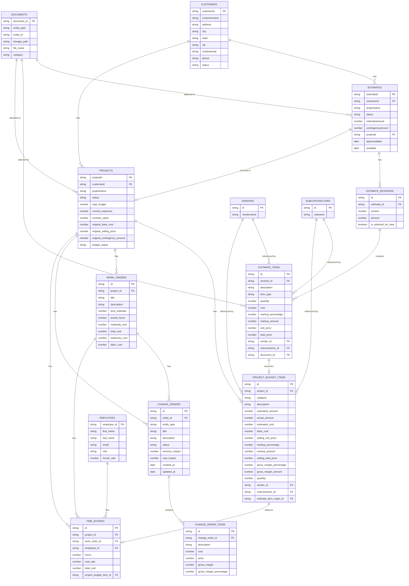

# Financial Entity-Relationship Diagram

Below is an entity-relationship diagram showing the relationships between all finance-related tables in the application.

Note: This ERD represents a comprehensive view of all finance-related tables and their relationships based on our codebase analysis. Some fields and relationships may be simplified or inferred.
