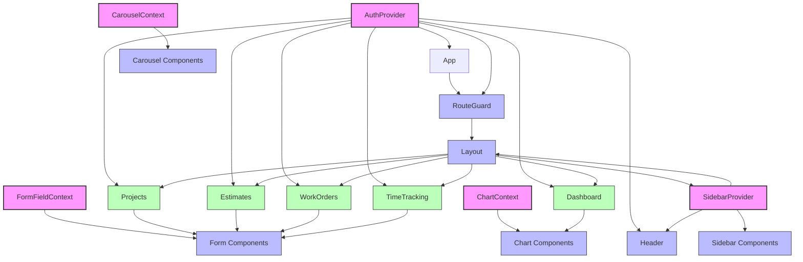

# State & Context Diagram

This document maps out the React context providers in the application and their consumers.

## Context Providers

### AuthContext

The `AuthContext` provides authentication state management across the application.

**Provider**: `AuthProvider` in `src/contexts/AuthContext.tsx`

**Context Value**:

```typescript
{
  session: Session | null;
  user: User | null;
  isLoading: boolean;
  signInWithGoogle: () => Promise<void>;
  signOut: () => Promise<void>;
}
```

**Primary Consumers**: `RouteGuard`, `Header`, pages requiring auth state

### SidebarContext

The `SidebarContext` manages the state of the application sidebar.

**Provider**: `SidebarProvider` in `src/components/ui/sidebar.tsx`

**Context Value**:

```typescript
{
  isOpen: boolean;
  toggle: () => void;
  // Additional methods for sidebar state management
}
```

**Primary Consumers**: `Sidebar`, `SidebarContent`, `Layout`

### FormFieldContext

The `FormFieldContext` provides form field state to form components.

**Provider**: `FormField` in `src/components/ui/form.tsx`

**Context Value**:

```typescript
{
  name: string;
}
```

**Primary Consumers**: Form field components

### ChartContext

The `ChartContext` provides chart configuration and state to chart components.

**Provider**: `ChartContainer` in `src/components/ui/chart.tsx`

**Context Value**:

```typescript
{
  // Chart-related state and configuration
}
```

**Primary Consumers**: Chart visualization components

### CarouselContext

The `CarouselContext` manages carousel state for the carousel component.

**Provider**: `Carousel` in `src/components/ui/carousel.tsx`

**Context Value**:

```typescript
{
  // Carousel-related state and methods
}
```

**Primary Consumers**: Carousel item components

## Mermaid Diagram


